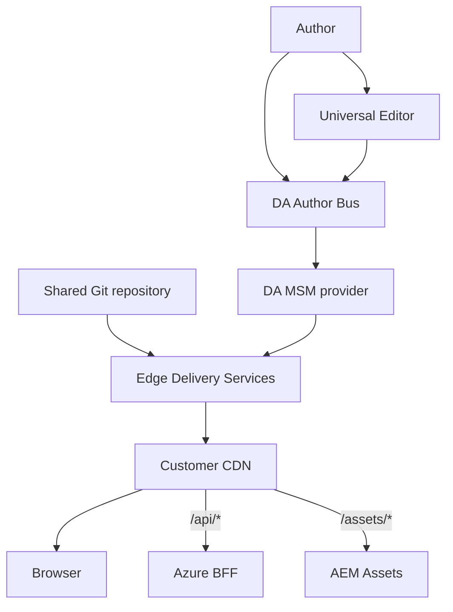

# Architecture

## Ownership

| Layer | Responsibility |
|---|---|
| DA Author Bus | Base and live-copy content, locale fragments, local overrides |
| Universal Editor | In-context editing of the same DA Author Bus content |
| DA MSM | Site-level inheritance based on whether the satellite path exists |
| Git | Shared blocks, styles, UE models, React source and configuration templates |
| EDS | Preview/live delivery for `base-site`, `ca-site`, `fr-site`, and `us-site` |
| Customer CDN | Domains, locale routes, APIs and optional Assets routing |
| Azure BFF | Authentication, aggregation and microservice policy |
| AEM Assets | Optional DAM only; never an AEM Sites page source |

## Organization separation

`daOrg`, `edsOrg`, and `git.owner` are separate configuration values. In the normal GitHub setup, `edsOrg` equals `git.owner`; `daOrg` can change for a new Author Bus tenant while every EDS site continues using the same GitHub repository.

## Locale and inheritance rules

1. `base-site` owns `/en/**` and `/fr/**`.
2. `ca-site` exposes both roots; `fr-site` and `us-site` expose `/fr/**` only.
3. Missing satellite files inherit the identical path from `base-site`.
4. Creating a satellite file cancels inheritance for that path only.
5. Header and footer loaders resolve `/<locale>/nav` and `/<locale>/footer` unless page metadata specifies an explicit fragment.
6. CDN rules expose only the locale roots declared for each country site.
